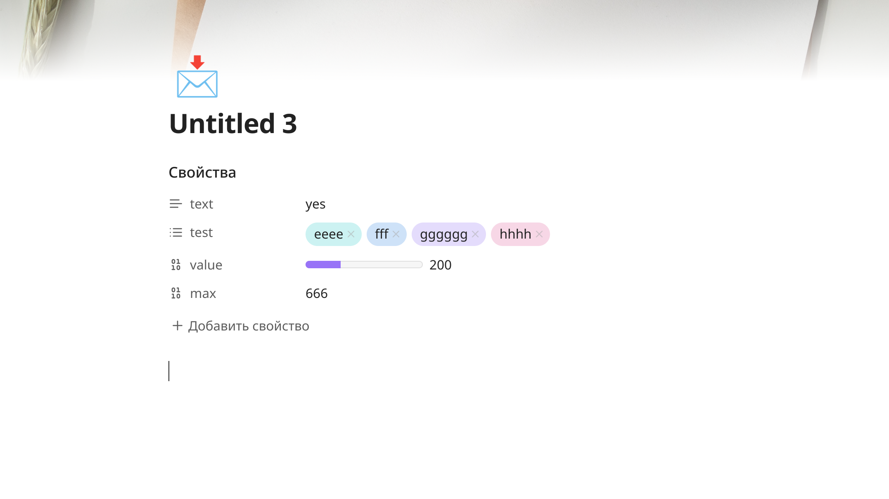
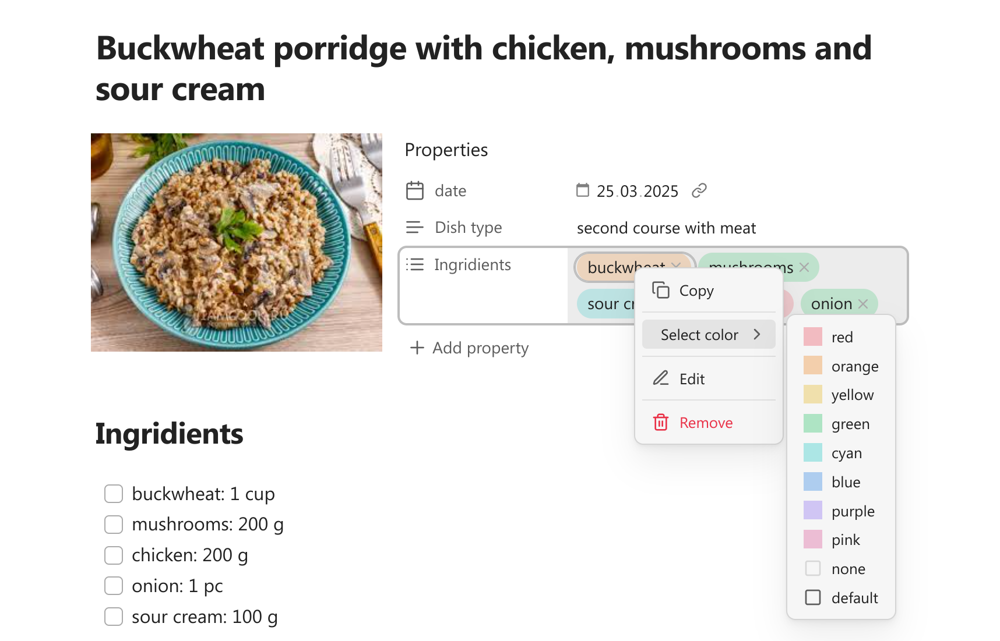
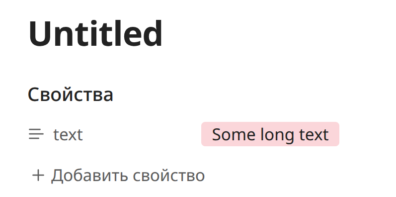
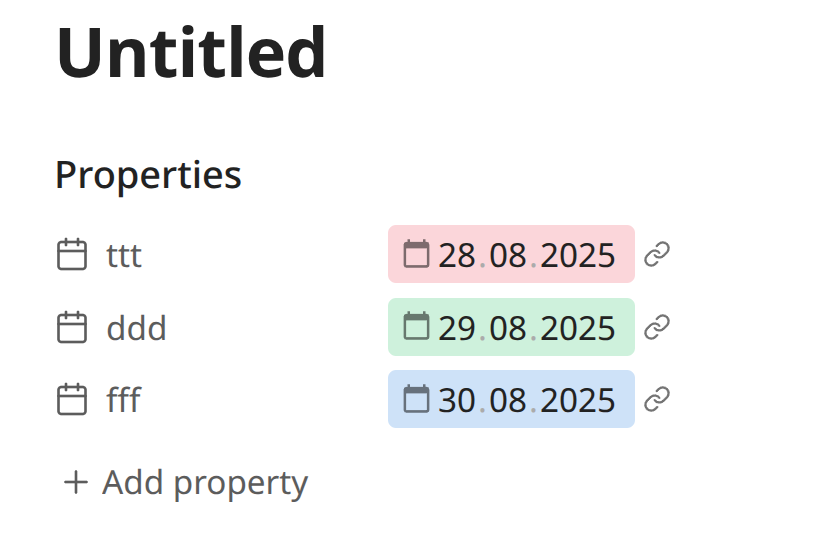
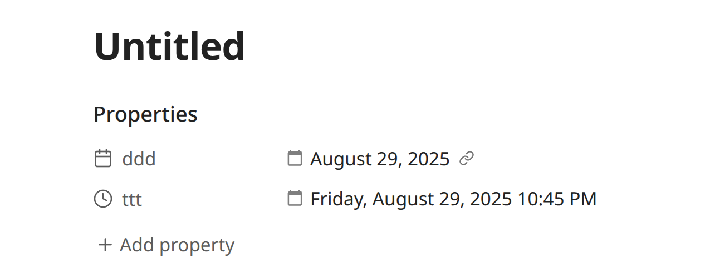
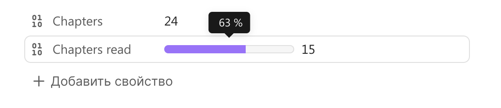
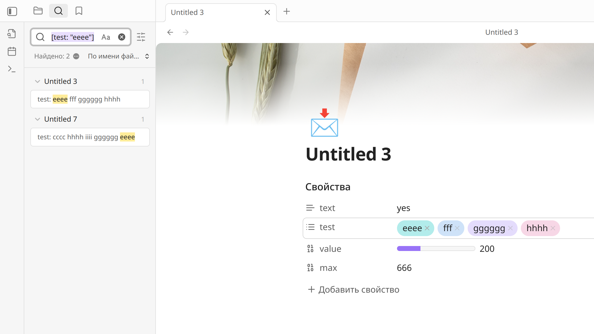
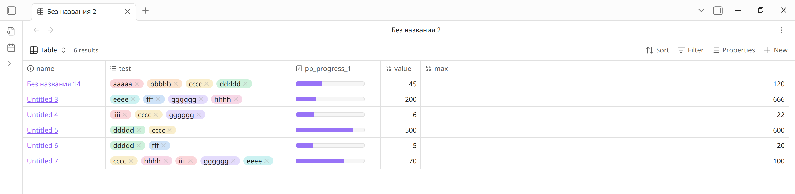

# Pretty properties

This plugin makes metadata block on the top of the file more visually appealing with images and colors.


## Features

### Cover image

Add image to the left of metadata block to save space in the note. Works great for book notes, people profiles etc. You can change the shape and size of the image.

To add cover image you can use command "Select cover image" from the command pallete. Then you can select a local image from your vault or add a link to the external image. You can set specific folder to look for the local cover images.

Adding the cover will add the "cover" property to your note. Do not delete the property, it is needed for the image to show. You can hide the property instead. You can also change this property name in the setting.

Right-click on the cover to change it's shape or select another image. You can use initial shape with 3 custom widths, vertical, horizontal, square and circle. Shapes are stored in cssclasses property. You can set the custom width for every shape.

> [!NOTE]  
> Cover shapes would look a bit different on mobile devices with small screen. This is intentional to make them look more neat in the limited space.


### Banner

You can add simple banners to your notes. To do so run command "Select banner image". It will add the "banner" property to your note. Right-click on the banner to change the banner image or it's position.  
You can set specific folder to look for the local banner images.


  

### Icon

You can add icons alongside tha banner or just on their own. To do this run the command "Select icon". This will ad the "icon" property to you note. For the icon you can use images, built-in Lucide icons or any symbols, including emoji:

-   add internal or external link to add image;
-   add the name of lucide icon, for example "star", to add svg icon;
-   if you add any other text, the first symbol will be shown as icon.

You can set a specific folder to look for local icon images.



### Hide properties

If you have many properties in the note, you may want to hide some of them while keeping the others visible. This plugin makes it easy. Click on the property icon and select "Hide property" in menu. If you want to see it again, run command "Toggle reveal / hide all hidden properties". After that you will see the hidden properties and can mark them as not hidden.

Banner, cover and icon properties can be hidden or revealed from the menus opened by right-clicking on the banner / cover / icon image.

  

### Colorful list properties

You can make you list properties stand out by assigning each item their own color. Right-click on the item pill to select color. You can also chose "none" to make the pill background transparent or reset it to default. You can use the theme colors or select your own custom color.



You can also add you own styling to the list properties. Each of them (even not colored ones) will get attribute "data-property-pill-value" containing actual value of item. You can use these attributes to write you own css for any individual item like this:

```
[data-property-pill-value="my-property-value"] {    /* my styles */}
```

  

### Colorful tags

You can add color to tags the same way as to the list properties. If you want to see the colored tags not only in properties, but also in the note text, you need to turn this option on in the settings.

By default Obsidian does not allow to style tags with non-latin characters in Live preview mode, but this plugin makes it possible.

> [!WARNING]  
> The option to show colored tags in the note is currently conflicting with the Iconic plugin tags styling. Don't use both at the same time, or you may get inconsistent results. Also don't use it with any other plugin that changes tags.

  

### Colorful text properties

You can also add color to the text properties. Hover over property value to reveal the color button. Remember, then the color assigned to the specific text, so if you edit the text the color may disappear. If you don't want to see the color button, you can turn it off in the settings.



  

### Date colors

Every date property gets an attribute "data-relative-date" with the possible values being "past", "present" and "future". It allows to style dates differently based of their relation to the current time. You can add some css yourself or you can select the colors from the pickers in the settings to mark past, present and future dates.



Relative date attributes are not updated automatically as the time pass. If the time have come for the "present" date to be turned into the "past" date, you need to reopen the note to change the color.

### Custom date formats

You can select custom formats for the date and datetime properties. Set format in the settings using the moment.js syntax. 



Keep in mind that the date presentation is changed by adding extra element to the property and hiding the actual input text. Because of that the text of the date will become uneditable. You can still edit the date with calendar picker. This also makes the changed date to look a little different, especially with color.

Custom dates in bases are disabled by default, because they can make bases slower. You can turn them on in settings. This function is also not supported in base cards: if you want the custom date format in base cards, you should use the formula instead, because dates in cards are not editable anyway.

> [!WARNING]  
> This is an experimental feature and can work incorrectly on some devices! If you expirience some issues with custom dates, please open an issue and provide information about your OS.

### Progress bars

Add simple progress bar to any number property. By default maximum value of progress bar is 100 and property value is treated as percent. If you want to add custom number as progress maximum, you need to add additional number property to the note and in the first property menu select the option "Set max progress from another property".



### Sync tasks count to properties

If you set special properties for tasks, completed tasks and uncompleted tasks and add this properties to your note, the plugin will count existing tasks in the active note and periodically save the count number to the properties. It is useful if you want to show task count in Bases or see task progress inside your note.

  

### TaskNotes integration

Task count can also work with the task created by TaskNotes plugin. You can count both inline tasks and project tasks. You will have to set up specific properties for this in the settings.

  

### Property search

If you Ctrl+click on any property value, the plugin will open search for this value in the search tab (works only on desktop). If the property value is a link you should click outside the link.



## Bases support 

Most of the properties functional, including coloed properties, custom date formats and math rendering also work in bases.



Since version 1.9.0 the plugin does not support progress-bars in bases anymore, because you can create progress-bars using regular base formulas. Here is a couple of examples of formulas you can use (or you can write your own).

Progress-bar formula:

```
if( note["maxProperty"], html("<progress class='metadata-progress' max='" + 
note["maxProperty"] + "' value='" + 
if(note["valueProperty"], note["valueProperty"], 0) + 
"' aria-label='" + 
if(note["maxProperty"], (if(note["valueProperty"], note["valueProperty"], 0) / note["maxProperty"] * 100).round(), " ") + " %" + 
"' data-tooltip-position='top' data-tooltip-delay='500'>"), "")
```

Progress circle formula:

```
if(note["maxProperty"], html("<div class='metadata-circle-progress'  style='background: radial-gradient(closest-side, var(--background-primary) 64%, transparent 65% 100%), conic-gradient(var(--color-accent-1) " + if(note["maxProperty"], (if(note["valueProperty"], note["valueProperty"], 0) / note["maxProperty"] * 100).round(), 0) + "%" + ", var(--background-secondary) 0);' aria-label='" + 
if(note["maxProperty"], (if(note["valueProperty"], note["valueProperty"], 0) / note["maxProperty"] * 100).round(), " ") + " %" + 
"' data-tooltip-position='top' data-tooltip-delay='500'></div>"), "")
```


## Installation

Untill this plugin is made availiable in the official plugins menu it can be insalled via BRAT:

1.  Install the BRAT plugin from "Community plugins" page.
2.  Go to the BRAT settings.
3.  Click "Add Beta Plugin" button.
4.  Paste the following URL in the text field: [https://github.com/anareaty/pretty-properties](https://github.com/anareaty/pretty-properties).
5.  Select the latest release.
6.  Make sure that "Enable after installing the plugin" is checked.
7.  Click "Add Plugin" button.

## Acknowledgments

This plugin uses a bit of code from the [Iconic plugin](https://github.com/gfxholo/iconic) to be able to add new items to menus.