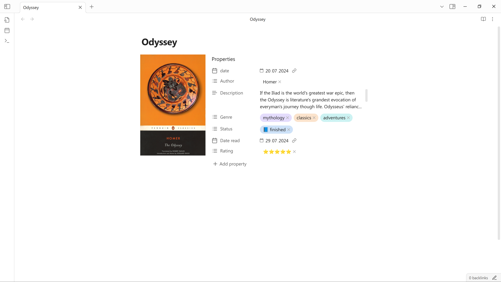
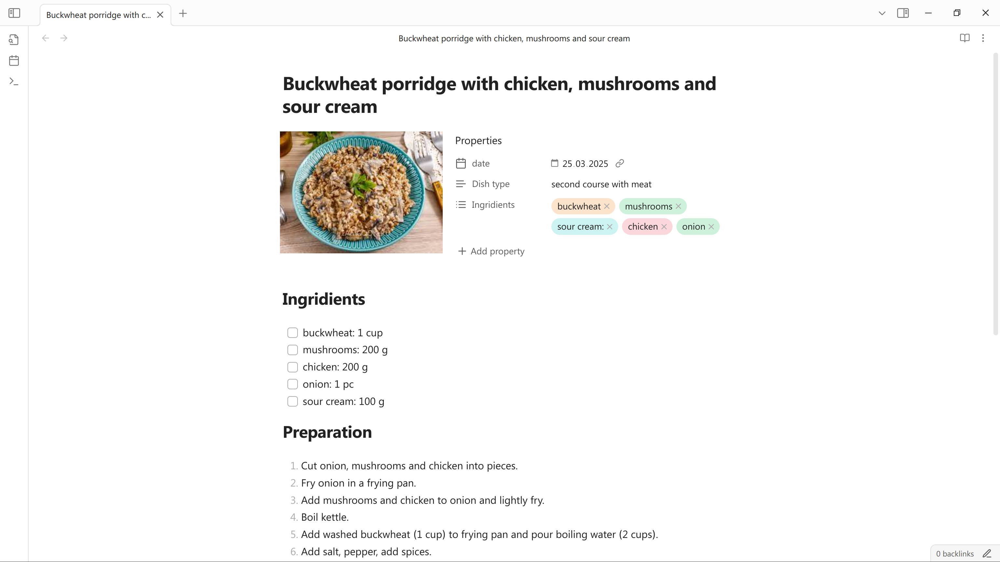
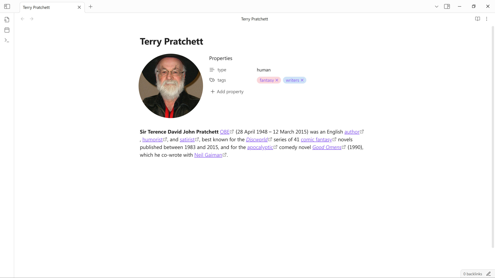

# Pretty properties

This plugin makes metadata block on the top of the file more visually appealing with images and colors.

## Features

### Cover image

Add image to the left of metadata block to save space in the note. Works great for book notes, people profiles etc. You can change the shape and size of the image using cssclasses.

To add image put image link into the "cover" property (must be of type "text"). You can use embeds,  wikilinks, markdown links or bare urls for external images. 

Add cssclasses to the note to change the shape of the image. Currently supported classes are "cover-vertical", "cover-horizontal", "cover-square" and "cover-circle". 

### Banner

You can add simple banners to your notes. To do so add the link to the "banner" property the same way as with cover. 

I know that there are the other plugins that add banners, which have more options, so if you want to use one of them along with this plugin, turn off the banner functional in the settings. I intend to keep this very basic and simple, and will not add any complex banner features. 

Banners might nor work well with every theme. If you banner margins are weird you will need to make some manual adjustments with css.

You may notice that you notes started to open slightly slower if you use banners. Actually they are not opening slower, but just made so the note content is invisible until banner fully loaded, to prevent annoying blinking. 

### Hide properties

If you have many properties in the note, you may want to hide some of them while keeping the others visible. This plugin makes it easy. Click on the property icon and select "Hide property" in menu. If you want to see it again, run command "Toggle reveal / hide all hidden properties". After that you will see the hidden properties and can mark them as not hidden.

### Colorful list properties

You can make you list properties stand out by assigning each item their own color. Right-click on the item pill to select color. You can also chose "none" to make the pill background transparent or reset it to default. Only basic theme colors are supported for now.

You can also add you own styling to the list properties. Each of them (even not colored ones) will get attribute "data-property-pill-value" containing actual value of item. You can use these attributes to write you own css for any individual item.
